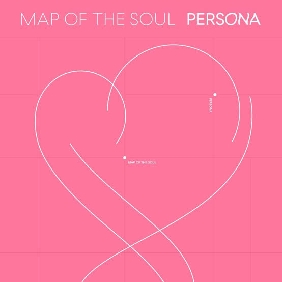

<html>
<title> Persona </title>
<head>

<h3><i>.....MAP OF THE SOUL:PERSONA.....</i></h3>
</head>

<body  style="background:#ffccd7; font-style:italic;">

<i>Map of the Soul:Persona</i> is  the sixth extended play by 
South Korean boy band BTS. It was released on April 12, 2019, via Big Hit Entertainment 
with <i>Boy With luv</i> as its lead single. It is the follow-up to their 2018 album 
<i> Love Yourself:Tear</i> and <i>Love Yourself:Answer</i>, and precedes the band's 
<i>Love Yourself:Speak Yourself</i> world tour. The EP was released for pre-order on March 13. 
It debuted at number one on the US Billboard 200, making BTS the first band since  
<i>The Beatles</i> to have three number-one albums in less than a year. The album also 
topped the UK, Scottish, New Zealand and Australian charts, making BTS the first Korean act 
to achieve a number-one album in each of these countries. Moreover, the album sold 3.2 million 
copies in one month, making it the best-selling album in South Korea after 24 years. 
A track from the EP, <i>Make It Right</i> released as second single featuring Lauv on 
October 18, 2019.

</body>
</html>
